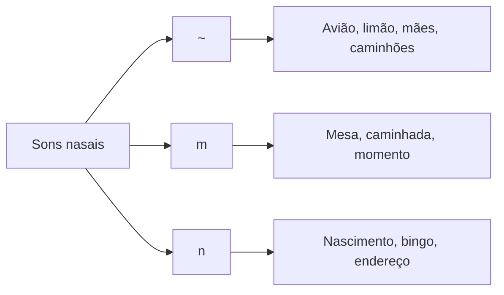

# Sons nasais

```mermaid
graph LR
    sn[Sons nasais]
    til["~"]
    n
    m
    til_exs["Avião, limão, mães, caminhões"]
    n_exs["Nascimento, bingo, endereço"]
    m_exs["Mesa, caminhada, momento"]
    sn --> til & m & n
    til --> til_exs
    n --> n_exs
    m --> m_exs    

    click m "https://www.dicio.com.br/m/"
    click n "https://www.dicio.com.br/n/"
    click til "https://www.dicio.com.br/til/"
```
